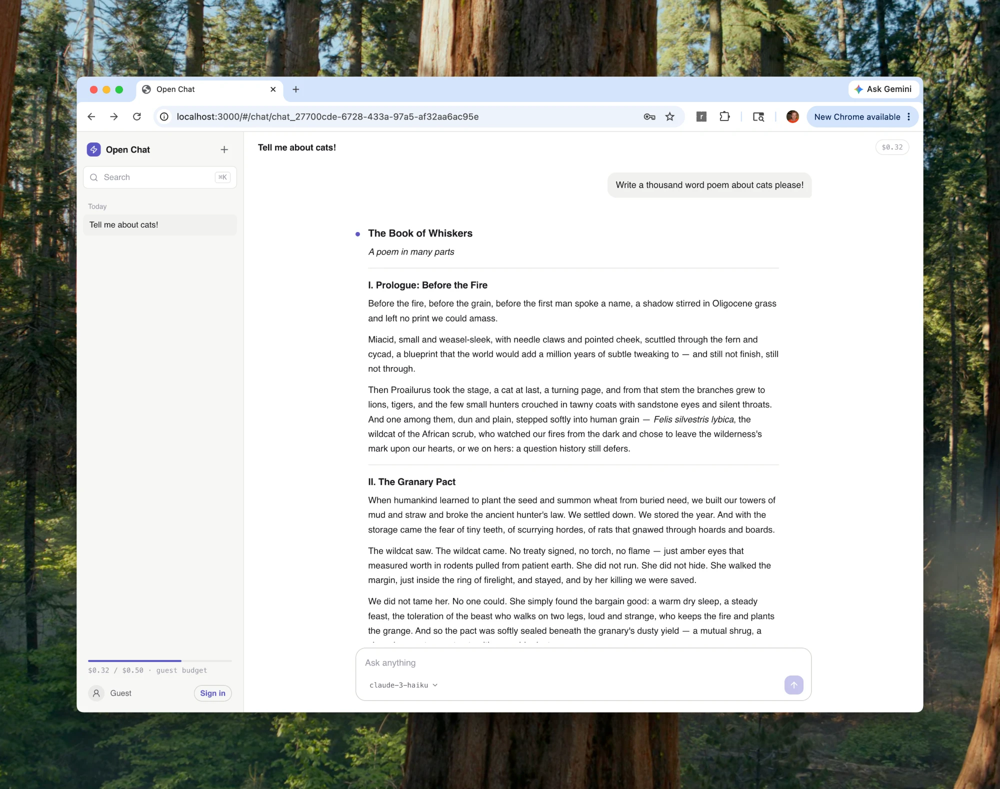

<p align="center">
  
</p>

# Open Chat

> [!TIP]
> **Try it live at [oss.chat](https://oss.chat)** — no sign-up required, you get a guest budget and can start chatting right away.

A local-first, multi-model AI chat app — and a working demonstration of how [Prisma Streams](https://github.com/prisma/streams), [Prisma Postgres](https://www.prisma.io/postgres), and Prisma Next fit together in a real application.



Every assistant token is appended to a durable stream **before** the browser renders it. Close the tab mid-answer, reopen it, and the response replays and finishes exactly where it left off. No message is ever lost to a dropped connection.

## What it demonstrates

- **Prisma Streams** as the system of record for chat messages: an append-only event log per user, with a routing key per chat. Appends are durable before delivery; reads resume from any offset.
- **Prisma Postgres** (via `prisma dev`) for everything relational: users, sessions, chat metadata, and usage accounting — fully local.
- **Prisma Next** as the typed data layer: the contract in [`src/prisma/contract.prisma`](src/prisma/contract.prisma) drives an end-to-end typed client, sharing one `pg.Pool` with Better Auth.

## Features

- Streaming chat with any text model on [OpenRouter](https://openrouter.ai) — switch models mid-conversation; each message records which model wrote it
- Durable, resumable streams: refresh, reconnect, or restart the server without losing tokens
- Anonymous guest sessions to try it instantly; sign up with email, GitHub, or Google and your guest chats come with you
- Credit-based billing: $2.00 free on signup, Stripe top-ups from $5 to $100 with a transparent 10% fee, and a free $0.50 drip after a month at zero
- Usage metering in micro-USD with a per-chat, per-model cost breakdown
- Markdown rendering, message permalinks, chat search, rename, and delete
- One process, no build step: Bun serves the API, the SSE proxy, and the React client

## How it works

```text
Browser (React + TanStack DB)
   │  fetch /api/*            ▲ SSE /api/chats/:id/events
   ▼                          │
Bun server ── Better Auth (sessions, guests)
   │
   ├── Prisma Next ──► Prisma Postgres   chats, users, usage
   │
   ├── Prisma Streams                    durable message events
   │     one stream per user, routing key per chat
   │
   └── OpenRouter                        model streaming (only external call)
```

Sending a message appends a durable `message.created` event, then streams the model's reply as `message.delta` events into the same stream. The browser consumes them over an authenticated SSE proxy and folds them into messages with the same pure function the server uses for history replay ([`src/shared/messages.ts`](src/shared/messages.ts)).

The full design is written up in [`docs/architecture.md`](docs/architecture.md).

## A tour of the code

The whole app is ~5,500 lines, and the durable-streaming core is much smaller
than that. Reading these files in order tells the entire story:

| | File | What it shows |
| --- | --- | --- |
| 1 | [`src/prisma/contract.prisma`](src/prisma/contract.prisma) | The **Prisma Next** contract: users, sessions, chats, usage — everything relational, fully typed end to end |
| 2 | [`src/server/streams.ts`](src/server/streams.ts) | The **Prisma Streams** client: one append-only stream per user, one routing key per chat, reads resumable from any offset |
| 3 | [`src/server/routes/messages.ts`](src/server/routes/messages.ts) | The core path: append the user's message durably, stream model deltas into the same log, tail it over SSE |
| 4 | [`src/shared/messages.ts`](src/shared/messages.ts) | The materializer that folds the event log into messages — shared by server-side replay and the live client feed, so both always agree |
| 5 | [`src/client/stream.ts`](src/client/stream.ts) | The client side of resumability: consume SSE, fold events, reconnect from the last offset |
| 6 | [`src/client/db.ts`](src/client/db.ts) | UI state as TanStack DB collections over the API |
| 7 | [`src/streams-app/index.ts`](src/streams-app/index.ts) | The deployable Streams service: `@prisma/streams-server` with R2 as the durable tier, in ~30 lines of deployment defaults |

Everything else is ordinary app code: route handlers grouped by domain in
[`src/server/routes/`](src/server/routes), React components in
[`src/client/components/`](src/client/components), and billing/auth as
supporting features around the core.

## Getting started

You need [Bun](https://bun.sh) ≥ 1.2 and an [OpenRouter API key](https://openrouter.ai/keys).

```bash
# 1. Install dependencies
bun install

# 2. Start local Prisma Postgres + Prisma Streams
bun run db:dev

# 3. Configure the environment
cp .env.example .env
#    – set DATABASE_URL and STREAMS_URL to the URLs printed by:
#      DATABASE_URL=... bunx prisma dev ls
#    – set OPENROUTER_API_KEY and a random BETTER_AUTH_SECRET

# 4. Create the database tables
bun run db:init

# 5. Run the app
bun run dev
```

Open <http://localhost:3000> — you'll be signed in as a guest automatically and can start chatting.

## Deploy to Prisma Compute

The live instance at [oss.chat](https://oss.chat) runs on [Prisma Compute](https://www.prisma.io) as two apps in one project: the chat server and the durable Streams service it talks to. Deploying your own takes a few minutes with the [Prisma CLI](https://www.npmjs.com/package/@prisma/cli).

```bash
# 1. Sign in and create a project (this also provisions a Prisma Postgres database)
bunx @prisma/cli@latest auth login
bunx @prisma/cli@latest project create my-open-chat

# 2. Create the tables in the project's primary database
bunx @prisma/cli@latest database connection create <database-id>   # prints DATABASE_URL
DATABASE_URL=<that-url> bun run db:init

# 3. Deploy the Streams service (pick any long random key). It runs
#    @prisma/streams-server — the full Prisma Streams runtime — with R2 as
#    the durable tier: segments upload continuously, and a fresh instance
#    rehydrates from the bucket, so chat history survives the platform
#    replacing the instance (its local disk is ephemeral).
bunx @prisma/cli@latest app deploy --app Streams \
  --framework bun --entry src/streams-app/index.ts --http-port 8080 \
  --env STREAMS_API_KEY=<random-key> \
  --env DURABLE_STREAMS_R2_BUCKET=<bucket-name> \
  --env DURABLE_STREAMS_R2_ACCOUNT_ID=<cloudflare-account-id> \
  --env DURABLE_STREAMS_R2_ACCESS_KEY_ID=<r2-access-key> \
  --env DURABLE_STREAMS_R2_SECRET_ACCESS_KEY=<r2-secret> \
  --no-db --prod --yes

# 4. Deploy the chat app, pointing it at the database and the Streams URL from step 3
bunx @prisma/cli@latest app deploy --app open-chat \
  --framework bun --entry src/start.ts --http-port 3000 \
  --env DATABASE_URL=<that-url> \
  --env STREAMS_URL=<streams-app-url> \
  --env STREAMS_API_KEY=<random-key> \
  --env BETTER_AUTH_SECRET=<random-secret> \
  --env OPENROUTER_API_KEY=<your-openrouter-key> \
  --env APP_ORIGIN=<chat-app-url> \
  --no-db --prod --yes
```

That's it — the CLI builds locally, uploads, and the deployment is live in seconds. Secrets live only in Compute's env config, never in the repo. (On the very first deploy you don't know the app URL yet: deploy once, then set `APP_ORIGIN` to the printed URL and deploy again. Subsequent deploys keep their env vars.)

## Project layout

| Path | What lives there |
| --- | --- |
| [`src/server/`](src/server) | Bun HTTP server; route handlers grouped by domain in [`routes/`](src/server/routes), plus the Streams client, OpenRouter client, usage budgets, and auth |
| [`src/client/`](src/client) | React UI: a thin [`App.tsx`](src/client/App.tsx) gate, views in [`components/`](src/client/components), state as TanStack DB collections in [`db.ts`](src/client/db.ts) |
| [`src/shared/`](src/shared) | Zod contracts and the event-log → message materializer, shared by both sides |
| [`src/prisma/`](src/prisma) | Prisma Next contract and the typed database client |
| [`src/streams-app/`](src/streams-app) | The standalone Streams service deployed next to the app |
| [`docs/`](docs) | Architecture, feature checklist, design system, verification log; brand assets in [`docs/logo/`](docs/logo) |

## Scripts

| Command | Purpose |
| --- | --- |
| `bun run dev` | App server with hot reload |
| `bun run db:dev` | Local Prisma Postgres + Streams via `prisma dev` |
| `bun run db:init` | Create tables from the Prisma Next contract |
| `bun run db:generate` | Re-emit contract types after editing `contract.prisma` |
| `bun test` / `bun run typecheck` | Tests and strict TypeScript |

## Learn more

- [`docs/architecture.md`](docs/architecture.md) — the stream-per-user / routing-key-per-chat pattern, data ownership, and the durable streaming path
- [`docs/features.md`](docs/features.md) — every user flow, written as a verification checklist
- [`prisma-next.md`](prisma-next.md) — how the Prisma Next contract workflow operates in this repo

## License

[MIT](LICENSE)
